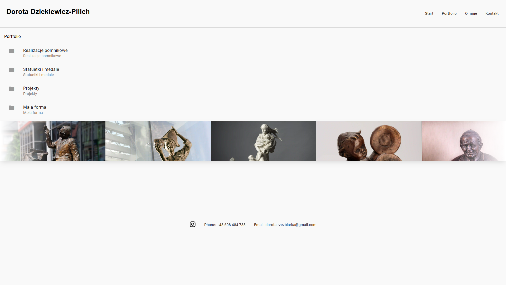
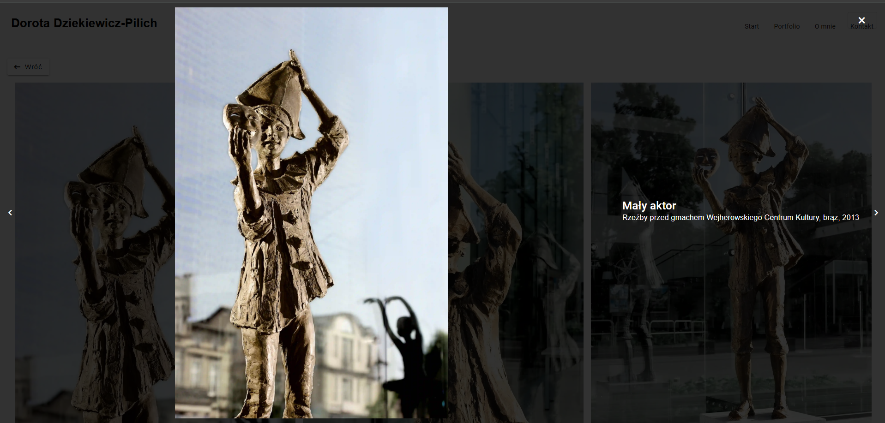

# rzezbiarka.pl

**Portfolio website for Polish sculptor Dorota Dziekiewicz-Pilich — monumental sculptures, statuettes, medals, and small-form works.**

**Live site:** [rzezbiarka.pl](https://rzezbiarka.pl)

🇬🇧 English | [🇵🇱 Polski](README.pl.md)

> Source code is private. This repository serves as project documentation.

---

## What it is

A production portfolio website for **Dorota Dziekiewicz-Pilich**, a professional sculptor with over 25 years of work spanning public monuments, bronze statuettes, medals, and small-form sculpture. The site presents her full catalogue in a categorised, image-first layout with a lightbox viewer that includes per-work metadata — title, materials, dimensions, and date.

---

## Screenshots

### Home — Slider & Featured Works

### Portfolio Categories

### Portfolio Lightbox

---

## Pages

| Route | Page |
|---|---|
| `/` | Home — hero slider, featured gallery, biography, roulette carousel |
| `/portfolio` | Portfolio — 4 category folders |
| `/portfolio/:category` | Category gallery with lightbox viewer |

**Portfolio categories:** Realizacje pomnikowe · Statuetki i medale · Projekty · Mała forma

---

## Features

- **Hero slider** — auto-rotating carousel of 7 featured works
- **Featured gallery** — grid of highlighted sculptures with lightbox modal
- **Roulette carousel** — animated portfolio sampler, pauses on hover
- **Biography section** — artist statement and timeline of major works (1998–2024)
- **Portfolio catalogue** — 4 categories, 33+ folders, hundreds of works with full metadata (title, materials, dimensions, date)
- **Lightbox viewer** — full-screen image modal with title, description, and artwork details
- **Keyboard navigation** — Escape / Backspace to close modals or navigate back
- **Responsive images** — WebP with JPG fallback, five breakpoints (480 · 768 · 1024 · 1366 · 1920px)
- **Responsive layout** — mobile hamburger menu, fluid grids across all screen sizes
- **Footer contact chips** — draggable chips linking to Instagram, phone, and email
- **Smooth scroll** — custom easeInOutQuad animation for fragment navigation

---

## Tech Stack

| Layer | Technology |
|---|---|
| Framework | Angular 18 (lazy-loaded feature modules) |
| Language | TypeScript 5.4 (strict mode) |
| UI components | Angular Material (Indigo-Pink theme) |
| Styling | SCSS + Normalize.css |
| Reactive layer | RxJS 7 |
| Image formats | WebP + JPG (responsive srcset) |
| Build | Angular CLI / esbuild |
| Hosting | Static hosting (no backend required) |
